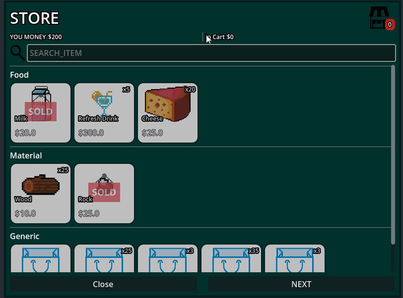

# GD Search Bar Node
Addon for allow custom show elements in runtime using custom multi-filters.

 

# Features
* Search by single root node.
* Search by multi root nodes.
* Search by group nodes.
* Filter by custom property.
* Search bar can use regular expression.

### Preview

# How to use
You only need a root node to search and the properties you want as criteria to filter.

## First
You must define the root where the filter will go

Define what you want using "Search By"
Search by has:
* Single root node.
* Multi root node.
* Group name for root nodes.
  
## Next step
you must define the properties of the nodes for the filter.

In the default configuration category, the filter has the “text” and “value” properties ideal for labels and select boxes, you can define your own properties or predefined properties; any property will work.

>[!TIP]
>You can define your custom properties from scripts.

## Finish
You can run and test the SearchBarNode, see the example scene if you need guidance.

### Aditional
You can display only the nodes with full match if you set discard_similars to true, The other side also shows some close match.

Copyrights (c) CodeNameTwister. See [LICENSE](LICENSE) for details.

[godot engine]: https://godotengine.org/
